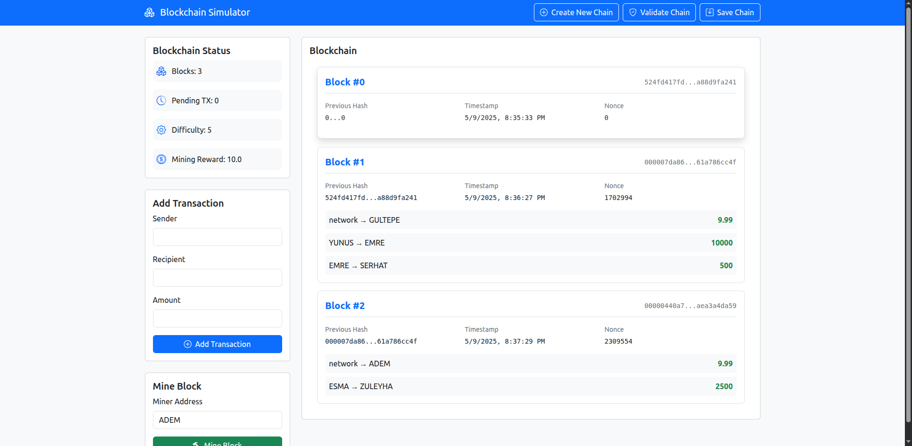
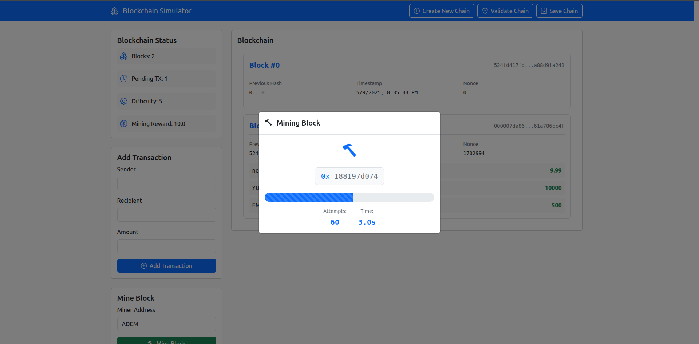

# Interactive Web-Based Blockchain Simulator

A Python and Flask web application that provides an interactive, visual simulation of a basic blockchain. Users can create chains, add transactions, mine blocks, and observe the blockchain's state through a dynamic web interface.

## Screenshots

Here are a couple of screenshots showcasing the application's interface:

**Main Interface Overview:**
Shows the dashboard, transaction form, mining form, and the blockchain display.


**Mining Process Modal:**
Illustrates the modal dialog that appears during the Proof-of-Work mining process, showing attempts and a visual representation.


## Features

- **Core Blockchain Logic:**
  - **Block Creation:** Implements `Block` objects with index, transactions, timestamp, previous hash, nonce, and SHA-256 hash.
  - **Transaction Management:** `Transaction` objects (sender, recipient, amount) with basic validation, and a pool for pending transactions.
  - **Proof-of-Work (PoW):** Simple PoW algorithm; mining difficulty is configurable.
  - **Mining Time Display:** The UI shows how long each mining operation (PoW search) takes.
  - **Mining Rewards:** A conceptual reward is granted to the miner for successfully creating and adding a new block to the chain.
  - **Chain Validation:** Verifies hash links, data integrity, and PoW for all blocks.
- **Flask Web Backend:**
  - **RESTful API:** Exposes endpoints to interact with the blockchain (create chain, get status, get blocks, add transaction, mine, validate, save).
  - **Serves Frontend:** Delivers the HTML, CSS, and JavaScript for the user interface.
- **Interactive Web Frontend:**
  - **Dynamic Updates:** Uses JavaScript (`fetch` API) to communicate with the backend and update the UI without page reloads.
  - **Visual Blockchain Display:** Renders blocks and their transactions in a user-friendly layout.
  - **Status Dashboard:** Shows current block count, pending transactions, difficulty, and mining reward.
  - **Forms for Interaction:** Allows users to add transactions and initiate mining.
  - **Mining Animation:** Provides visual feedback during the mining process.
  - **Toast Notifications:** Displays success and error messages.
  - **Responsive Design:** Uses Bootstrap for a clean and responsive layout.
- **Persistence:**
  - The blockchain state (chain, pending transactions, difficulty, mining reward) is saved to `blockchain_data.json`.
  - The application attempts to load this state on startup.
  - Users can explicitly save the current state via the UI.

## Requirements

- Python 3.7 or higher.
- Flask
- Flask-CORS (optional, for cross-origin API access)

Install dependencies using `pip install -r requirements.txt`. Your `requirements.txt` should ideally contain:
Flask>=2.0
Flask-CORS>=3.0
python-dotenv==1.0.1 # If you use .env files

_(Adjust versions as per your actual `requirements.txt` file)._

## Setup and Running

1.  **Clone or Download:**
    Ensure you have all project files (`app.py`, `blockchain.py`, `block.py`, `transaction.py`, `requirements.txt`, and the `static/` & `templates/` directories) in a single project folder.

2.  **Create and Activate a Python Virtual Environment (Recommended):**
    Open your terminal/command prompt in the project folder:

    ```bash
    python3 -m venv venv
    ```

    Activate the environment:

    - **macOS/Linux:** `source venv/bin/activate`
    - **Windows (Command Prompt):** `venv\Scripts\activate.bat`
    - **Windows (PowerShell):** `venv\Scripts\Activate.ps1`
      (If PowerShell fails, try `Set-ExecutionPolicy Unrestricted -Scope Process` first.)

3.  **Install Dependencies:**
    With the virtual environment activated:

    ```bash
    pip install -r requirements.txt
    ```

4.  **Run the Flask Web Application:**
    Execute the `app.py` script:

    ```bash
    python3 app.py
    ```

    The application will typically start and be accessible at `http://127.0.0.1:5000/`.

5.  **Open in Browser:**
    Navigate to `http://127.0.0.1:5000/` in your web browser.

6.  **Interact with the Web Interface:**
    - **Create New Chain:** Use the modal (top-right button) to initialize a new blockchain with specified difficulty and mining reward.
    - **View Status:** The dashboard on the left displays real-time updates to block count, pending transactions, difficulty, and mining reward.
    - **Add Transactions:** Use the "Add Transaction" form to submit new transactions to the pending pool.
    - **Mine Block:** Input a miner address in the "Mine Block" form and click the button to initiate Proof-of-Work. A mining animation modal will show progress.
    - **Display Blockchain:** The main area on the right dynamically displays the chain of blocks, including details for each block and its transactions.
    - **Validate Chain:** Click the "Validate Chain" button (top-right) to verify the integrity of the current blockchain.
    - **Save Chain:** Click the "Save Chain" button (top-right) to persist the current state to `blockchain_data.json`. The app also attempts to load this file on startup and offers to save on exit.

## How It Works - Web Application Flow

1.  **Backend (Flask - `app.py`):**

    - Initializes a `Blockchain` instance (loading from `blockchain_data.json` if available, or creating a new one).
    - Exposes several API endpoints (e.g., `/api/blockchain/status`, `/api/blockchain/blocks`, `/api/blockchain/add-transaction`, `/api/blockchain/mine`). These endpoints interact with the `Blockchain` object to perform actions (like adding a transaction or mining) and retrieve data (like the current chain or status).
    - Serves the main `index.html` page and static assets (CSS, JS).

2.  **Frontend (HTML, CSS, JavaScript - `templates/index.html`, `static/`):**

    - `index.html`: Provides the HTML structure of the web page, styled with Bootstrap.
    - `static/css/style.css`: Contains custom CSS for additional styling and animations.
    - `static/js/app.js`: Handles all client-side interactivity. It makes asynchronous `fetch` requests to the Flask API endpoints. Based on the JSON responses received from the backend, it dynamically updates the HTML content of the page (e.g., refreshing the status dashboard, re-rendering the blockchain display). It also manages form submissions and user feedback through modals and toast notifications.

3.  **Blockchain Core Logic (`blockchain.py`, `block.py`, `transaction.py`):**
    - The underlying blockchain simulation logic (block creation, Proof-of-Work, validation, save/load) is encapsulated in these Python modules. The Flask backend acts as an interface to this core logic, making it accessible via web requests.

## Future Enhancements (Potential Ideas)

- **WebSockets:** Replace API polling with WebSockets for more efficient, truly real-time updates.
- **User Accounts/Wallets:** (More advanced) Introduce a concept of user accounts to manage "wallets" and sign transactions.
- **Improved UI/UX:** Further refine the user interface for enhanced visual appeal and user experience.
- **Networked Simulation:** Extend to allow multiple instances of the app to connect and simulate a distributed blockchain network (very advanced).
- **Transaction Signatures:** Incorporate cryptographic signatures to verify the authenticity of transaction senders.
